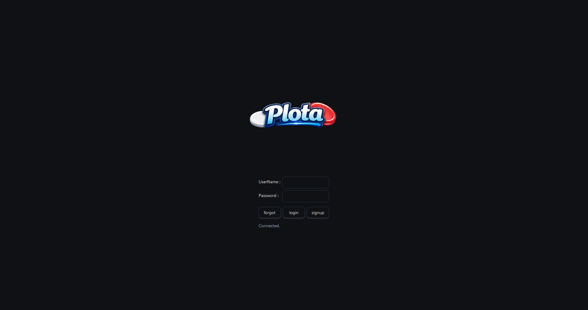
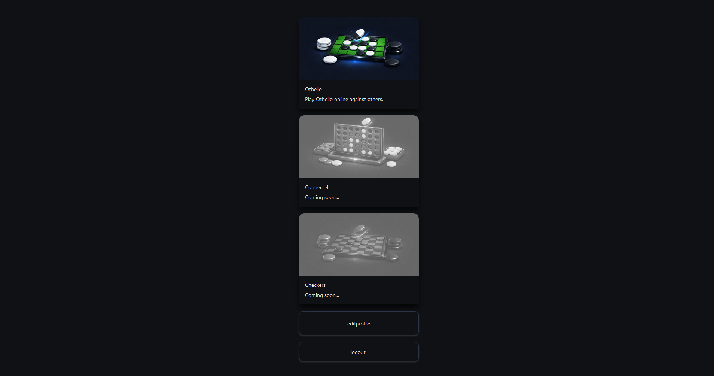
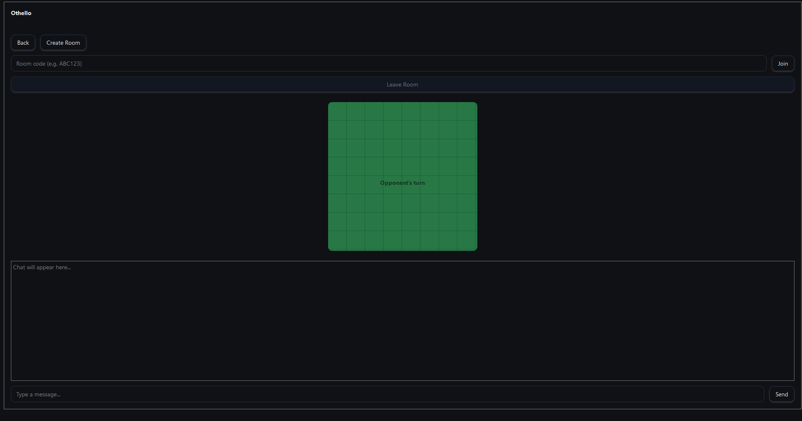

# Plota — Online Othello (Reversi) + Real-Time Chat

Plota is a full-stack application featuring an **online Othello (Reversi) game** with **real-time room creation** and **mid-game chat**. It includes a complete authentication flow (**Sign up / Sign in / Forgot password**) and a **profile editor**, packaged with a clean UI and partial responsiveness.

---

## ✨ Features

### ✅ Authentication & Accounts
- Sign up / Sign in
- Forgot password flow
- Profile edit (user info updates)

### 🎮 Online Othello (Reversi)
- Create and join online game rooms
- Real-time gameplay experience
- Match flow suitable for online play

### 💬 In-Game Chat
- Chat while playing (mid-game)
- Room-based messaging

### 🎨 UI
- Modern UI
- Responsive to some extent (works well on common sizes)

---

## 🖼️ Screenshots

> Screenshots are located in: `plota/ScreenShots/`

# login page
 

# main menu
 

# othello game
 

---

## 🧱 Project Structure

This repository contains **both client and server**:

